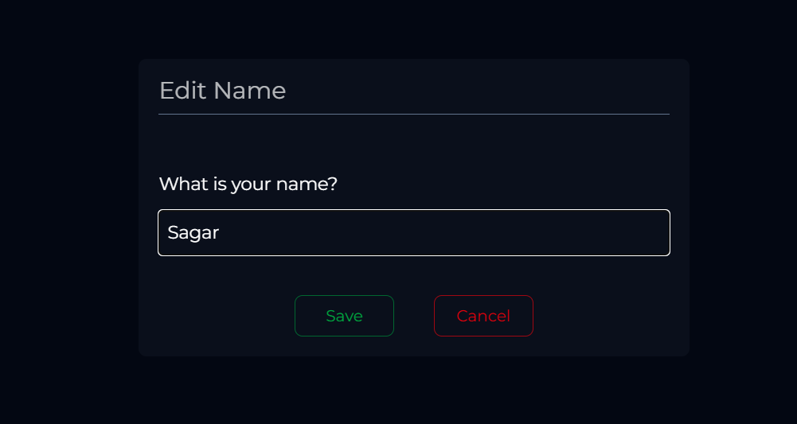
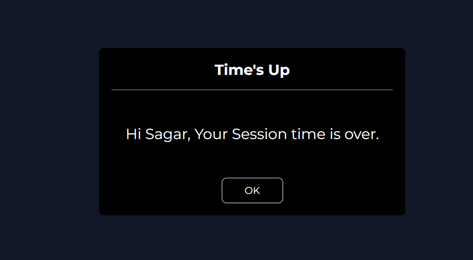
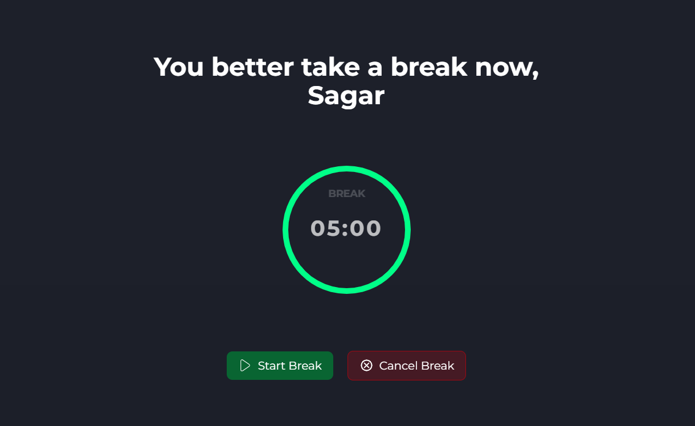
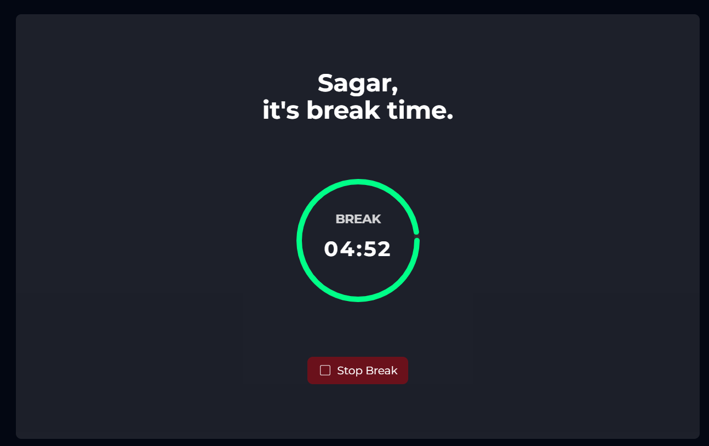

# ⏱️ Pomodoro Timer App

A minimal, clean, and customizable **Pomodoro Timer** app built with **ReactJS** with **Typescript**.  
This app helps you boost productivity using the Pomodoro technique — 25 minutes of focused work followed by short breaks.

---

## 📸 Preview






---

## 🚀 Live Demo

🌐 [Try it here](https://pomodoro-app-reactjs.vercel.app/)

---

## ✨ Features

- 👤 Personalized Welcome:  
  On first visit, user is asked for their name, e.g.,  
  _"Welcome to Pomodoro, Sagar!"_

- 📝 Editable User Name:  
  Click on the name at the top to open a modal and update it anytime.

- ⏳ Timer with Visual Circle:  
  25-minute work session with a real-time decreasing green progress circle.

- 🔔 Alarm & Popup:  
  After each session/break, a sound plays and a popup/modal shows "Time is over".

- 🔁 Automatic Cycle:  
  After 25-minute work session → 5-minute break starts automatically.  
  After break → new session begins.

- ⚙️ Fully Customizable Time:  
  You can set your own session and break durations.

---

## 🛠️ Tech Stack

- ReactJS  
- TypeScript  
- CSS Modules or TailwindCSS (depending on what you used)  
- Custom Hooks & React State  
- Audio API for alerts

---

## 📂 Folder Structure (Example)
```
POMODARO APP/
├── public/               # Static files
├── src/                  # Main source code
│   ├── assets/           # Images, sounds, and SVGs
│   ├── components/       # Reusable React components
│   ├── pages/            # Page-level components (e.g., Home.tsx)
│   ├── App.tsx           # Root component
│   ├── main.tsx          # Entry point
│   ├── index.css         # Global styles
│   └── vite-env.d.ts     # Vite environment definitions
└── README.md             # Project documentation
```

---

## 🔧 Installation

```bash
git clone https://github.com/robiulsagor/pomodoro-app-reactjs.git
cd pomodoro-app-reactjs
npm install
npm run dev
```

🧠 Inspiration
This app is inspired by the Pomodoro productivity method — a proven technique to stay focused and reduce mental fatigue.

🧑‍💻 Author
Made with ❤️ by [Md Robiul Islam](https://robiulportfolio.vercel.app/#_)

📜 License
This project is licensed under the MIT License.
